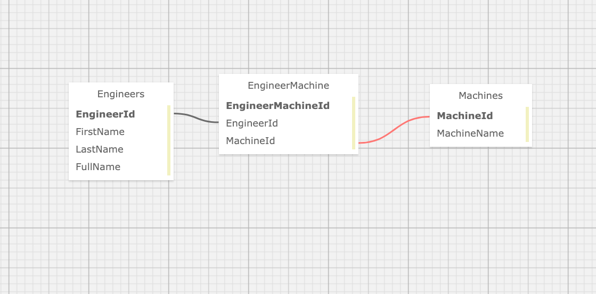

<br>
<h1 align = "center">
<b> Dr. Sillystringz's Factory </b>
</h1>

<p align = "center">
This application allows the user to keep track of Engineers and Machines in Dr. Sillystringz's Factory </p>
<p align = "center"> Created January 8, 2021 </p>

<p align = "center">
 By Kaila Sprague McRae
 </p>

--------------------

## 📖  Description

This application allows the user to keep track of Engineers and Machines in Dr. Sillystringz's Factory. The user can add Machines to an Engineer who is licensed to do so and add Engineers to a Machine. 

This is the Independent Project for Epicodus week 11 as part of the "Many-to-Many Relationships" coursework. 


[](https://gifyu.com/image/Fwja)

--------------------

## 🛠️ Technologies Used

This project uses the following technologies:

- C# v7.3.0
- .NET Core v2.2.0
- ASP .NET MVC
- ASP .NET Core Razor Pages
- MySQL
- MySQL Workbench
- Entity Framework Core

-------------------

## Specifications




<details>
<summary>User Stories</summary>

| Story# | User Story | Complete |
| :------------- | :------------- | :------------- |
| 01 | As the factory manager, I need to be able to see a list of all engineers, and I need to be able to see a list of all machines. | true |
| 02 | As the factory manager, I need to be able to select a engineer, see their details, and see a list of all machines that engineer is licensed to repair. I also need to be able to select a machine, see its details, and see a list of all engineers licensed to repair it. | true |
| 03 | As the factory manager, I need to add new engineers to our system when they are hired. I also need to add new machines to our system when they are installed. | true |
| 04 | As the factory manager, I should be able to add new machines even if no engineers are employed. I should also be able to add new engineers even if no machines are installed. | true |
| 05 | As the factory manager, I need to be able to add or remove machines that a specific engineer is licensed to repair. I also need to be able to modify this relationship from the other side, and add or remove engineers from a specific machine. | true |
| 06 | I should be able to navigate to a splash page that lists all engineers and machines. Users should be able to click on an individual engineer or machine to see all the engineers/machines that belong to it. | false |

</details>

-------------------

## 🐛 Known Bugs

| Date | Error | Handled | Solution |
| :------------- | :------------- | :------------- | :------------- |
| 01.08.2021 | unable to display engineers `"LastName", "FirstName"` in drop down list when creating a new Machine | true | added get perameters to `FullName` in Engineer Class |

-------------------

## 🔧 Setup & Requirements

### 📋 Necessary Specifications

#### To run this project locally you will need:

- **ASP .NET Core :** You can check if you have .NET Core by running `dotnet --version` in the command line. If you do not have .NET Core please find more information and download [here](https://dotnet.microsoft.com/download/dotnet-core)
- **MySQL :**  You can download MySQL [here](https://dev.mysql.com/downloads/file/?id=484914) and MySQL Workbench [here](https://dev.mysql.com/downloads/file/?id=484391)
- **Prefered Code Editor**


### ⚙️ Clone or Download

#### To Download:

Go to my GitHub repository here, [https://guthub.com/kaila.spraguemcrae/FINISH-URL](https://guthub.com/kaila.spraguemcrae/FINISH-URL), and click on the green 'Code' button to clone the repository, Open with GitHub Desktop OR Download the ZIP file

#### To clone (my prefered method):

1. Push the green 'Clone' button and copy the URL.
2. Open Terminal or GitBash and input the command: `git clone https://github.com/kaila-spraguemcrae/FINISH-URL`
3. To view the code, open the copied directory with Visual Studio Code or your preferred text editor by inputing the command `code .` in your terminal.

### 🧰 Database Setup Options

#### AppSettings (option 1):

- After you have the project on your computer you will need to create a file in the root directory of the project called "appsettings.json". 
- Add the following snippet of code to the appsettings.json file:

```
{
  "ConnectionStrings": {
    "DefaultConnection": "Server=localhost;Port=3306;database=kaila_spraguemcrae_factory;uid=root;pwd=YOUR-PASSWORD-HERE;"
    }
}
```
*Please note you will need to replace `YOUR-PASSWORD-HERE` with the password you created for your MySQL server.

#### Import Database using Entity Framework Core (option 1 continued):

 - In the command line run ` cd Desktop/Factory.Solution/Factory` to navigate to the "Factory" folder. 
 - Next, run `dotnet ef database update` to generate the database. You can confirm the database was created by checking MySQL workbench.

*to make changed to the database you can run `dotnet ef migrations add <MigrationName>`

#### Import Database using MySQL Workbench (option 2):

- Open MySQL workbench and go to the navigation bar and select `Server > Data Import`. 
- Next, select the option `Import from Self-Contained File` and confirm you have the file `kaila_spraguemcrae_factory.sql` set to be imported (this files exists in the root directory of this project). 
- Then, set the `Defaul Target Schema` or create a new schema and select all the the Schema Objects you want to be imported. 
- Check that the option `Dump Structure and Data` is selected. Once you confirm you have all of the correct settings click `Start Import`.

#### Import Database using SQL Schema (option 3):

- Open your MySQL management tool and paste the following Create Statement to generate the database:

```
CREATE DATABASE `kaila_spraguemcrae_factory` /*!40100 DEFAULT CHARACTER SET utf8mb4 COLLATE utf8mb4_0900_ai_ci */;

CREATE TABLE `__EFMigrationsHistory` (
  `MigrationId` varchar(95) NOT NULL,
  `ProductVersion` varchar(32) NOT NULL,
  PRIMARY KEY (`MigrationId`)
) ENGINE=InnoDB DEFAULT CHARSET=utf8mb4 COLLATE=utf8mb4_0900_ai_ci;

CREATE TABLE `EngineerMachine` (
  `EngineerMachineId` int(11) NOT NULL AUTO_INCREMENT,
  `EngineerId` int(11) NOT NULL,
  `MachineId` int(11) NOT NULL,
  PRIMARY KEY (`EngineerMachineId`),
  KEY `IX_EngineerMachine_EngineerId` (`EngineerId`),
  KEY `IX_EngineerMachine_MachineId` (`MachineId`),
  CONSTRAINT `FK_EngineerMachine_Engineers_EngineerId` FOREIGN KEY (`EngineerId`) REFERENCES `engineers` (`EngineerId`) ON DELETE CASCADE,
  CONSTRAINT `FK_EngineerMachine_Machines_MachineId` FOREIGN KEY (`MachineId`) REFERENCES `machines` (`MachineId`) ON DELETE CASCADE
) ENGINE=InnoDB AUTO_INCREMENT=17 DEFAULT CHARSET=utf8mb4 COLLATE=utf8mb4_0900_ai_ci;

CREATE TABLE `Engineers` (
  `EngineerId` int(11) NOT NULL AUTO_INCREMENT,
  `FirstName` longtext,
  `LastName` longtext,
  PRIMARY KEY (`EngineerId`)
) ENGINE=InnoDB AUTO_INCREMENT=7 DEFAULT CHARSET=utf8mb4 COLLATE=utf8mb4_0900_ai_ci;

CREATE TABLE `Machines` (
  `MachineId` int(11) NOT NULL AUTO_INCREMENT,
  `MachineName` longtext,
  PRIMARY KEY (`MachineId`)
) ENGINE=InnoDB AUTO_INCREMENT=7 DEFAULT CHARSET=utf8mb4 COLLATE=utf8mb4_0900_ai_ci;
```

#### Running/viewing application:

1. Once you have opened the code in your preferred text editor you will need to navigate to the 'PROJNAME' folder (`cd PROJNAME`) in the command line and run `dotnet run` or `dotnet watch run`.
2. At this point you should be able to click on the link to the local server's url path to view the compiled project. 

--------------------------

## 📫 Support and contact details

If you run into any problems or have any questions please contact me via [email](mailto:kaila.sprague@icloud.com).

---------------------------

## 📘 License

MIT License

Permission is hereby granted, free of charge, to any person obtaining a copy
of this software and associated documentation files (the "Software"), to deal
in the Software without restriction, including without limitation the rights
to use, copy, modify, merge, publish, distribute, sublicense, and/or sell
copies of the Software, and to permit persons to whom the Software is
furnished to do so, subject to the following conditions:

The above copyright notice and this permission notice shall be included in all
copies or substantial portions of the Software.

THE SOFTWARE IS PROVIDED "AS IS", WITHOUT WARRANTY OF ANY KIND, EXPRESS OR
IMPLIED, INCLUDING BUT NOT LIMITED TO THE WARRANTIES OF MERCHANTABILITY,
FITNESS FOR A PARTICULAR PURPOSE AND NONINFRINGEMENT. IN NO EVENT SHALL THE
AUTHORS OR COPYRIGHT HOLDERS BE LIABLE FOR ANY CLAIM, DAMAGES OR OTHER
LIABILITY, WHETHER IN AN ACTION OF CONTRACT, TORT OR OTHERWISE, ARISING FROM,
OUT OF OR IN CONNECTION WITH THE SOFTWARE OR THE USE OR OTHER DEALINGS IN THE
SOFTWARE.

Copyright (c) 2020 Kaila Sprague McRae